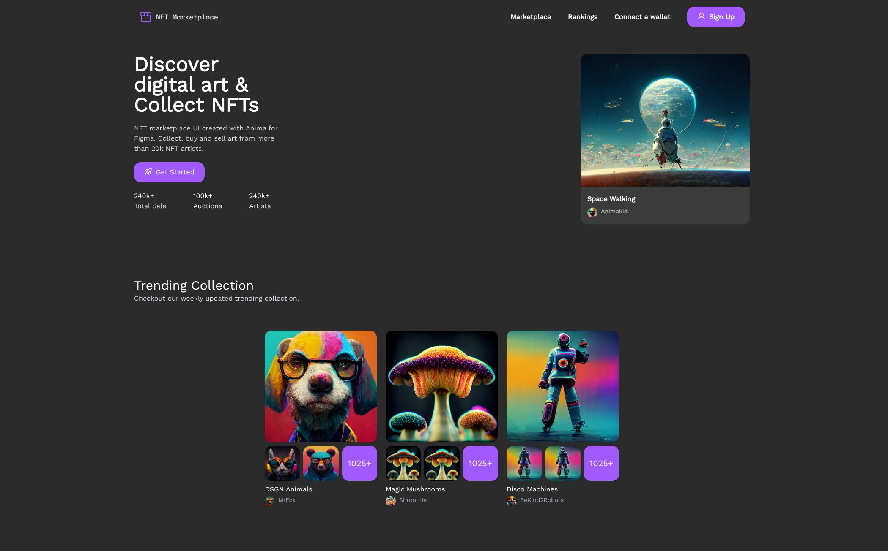
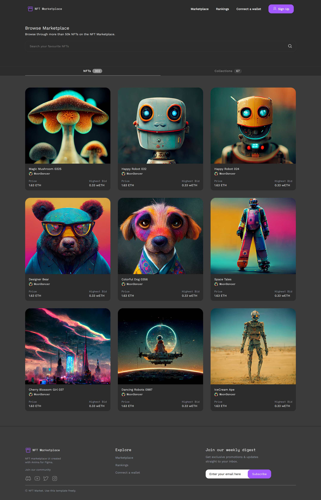
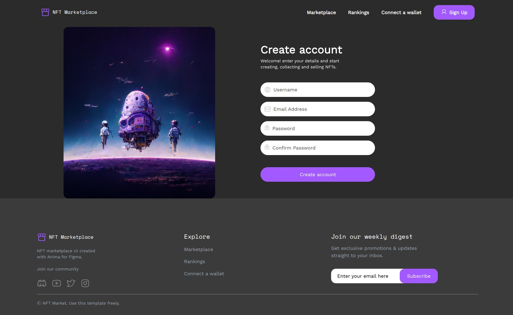
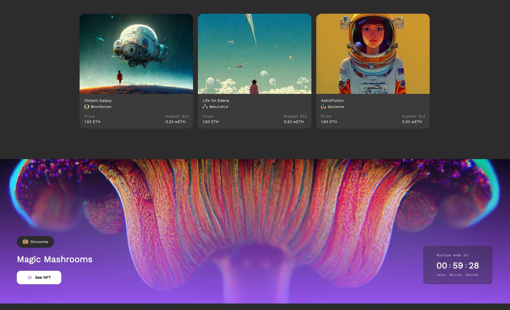
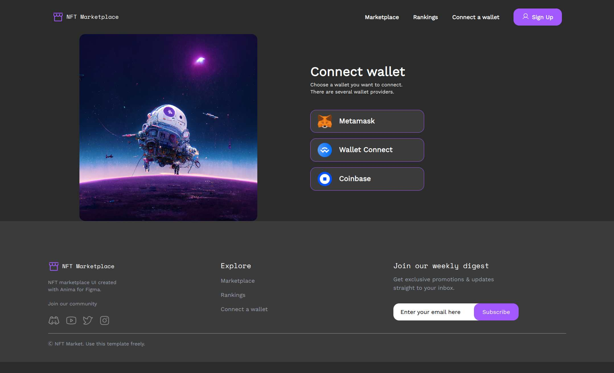

# 🪐 NFT Marketplace

### Modern NFT Marketplace • Dark UI • Smooth Animations

A modern and minimal NFT marketplace built with a dark visual experience,
smooth interactions, and animation-focused UI.

---

## 🎨 About

This project is a modern NFT marketplace focused on creating a visually
engaging and interactive user experience.

The interface uses a dark and minimal design language combined with smooth
animations, transitions, and interactive elements to create a dynamic
marketplace experience.

The project includes different sections for discovering NFTs, exploring
the marketplace, creating NFTs, managing wallets, and viewing individual
NFT collections.

---

## 🛠️ Technologies & Tools

| Frontend | Libraries | Tools |
|:---|:---|:---|
| HTML5 • CSS3 • JavaScript | Lenis • AOS • Rellax | Git • GitHub |
| Vue.js • Nuxt.js | | Vite • VSCodium |
| TypeScript • Tailwind CSS • Vuetify | | Linux • Ubuntu |

---

## ✨ Features

- 🌑 Dark and minimal UI
- 🎞️ Smooth animations and transitions
- 🖼️ NFT marketplace interface
- 🛒 Marketplace browsing experience
- 🎨 NFT creation interface
- 👛 Wallet interface
- 🍄 NFT collection showcase
- 📱 Responsive design
- ⚡ Interactive user experience

---

## 📸 Preview

| Home | Marketplace | Create |
|:---:|:---:|:---:|
|  |  |  |

| Mushroom | Wallet |
|:---:|:---:|
|  |  |

---
